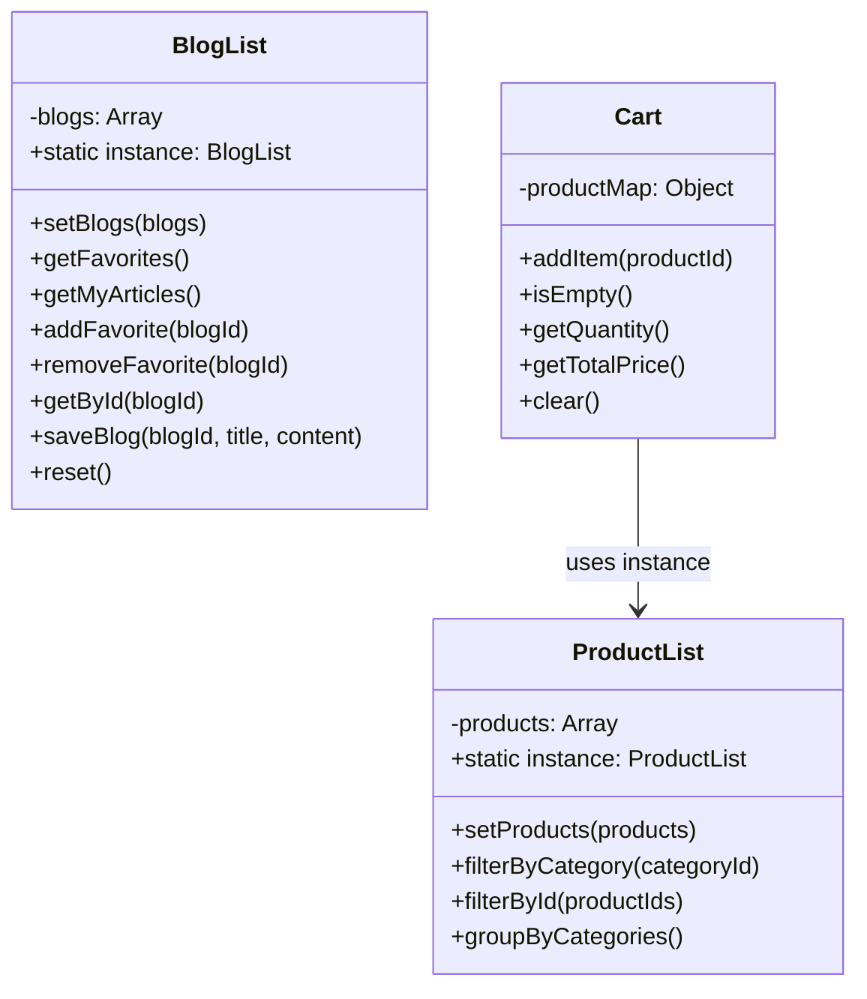
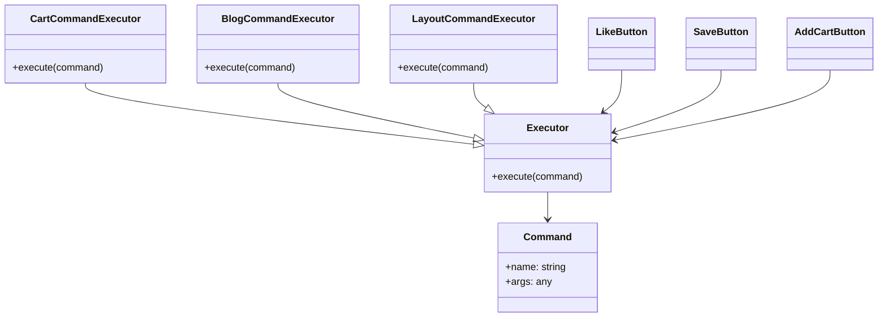
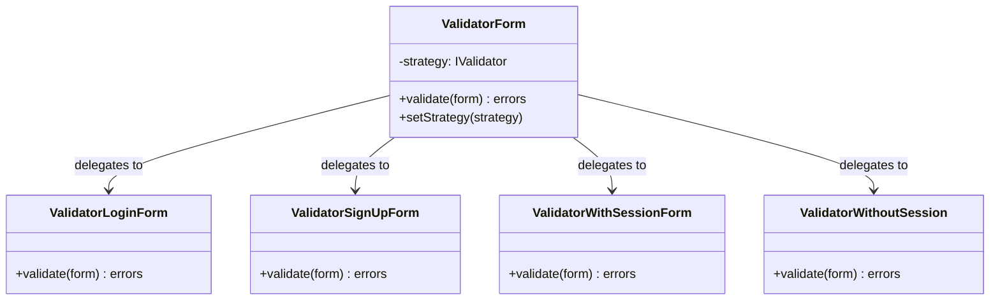
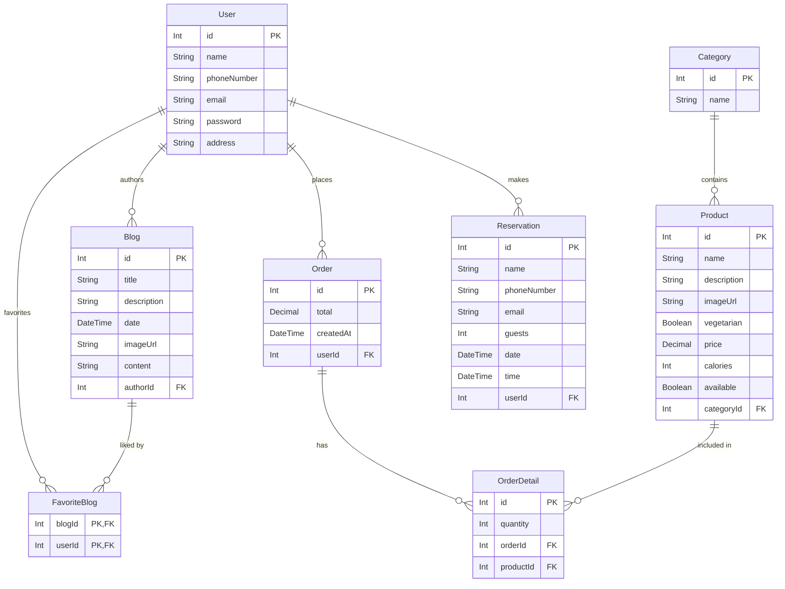

# SushiApp

A full-stack sushi restaurant management system featuring a Node.js/Express backend and two frontend implementations — one in Vanilla JavaScript (Web Components) and one in React.

---

## Tech Stack

| Layer | Technology |
|---|---|
| Backend | Express.js 5, Prisma 6, PostgreSQL, JWT, bcrypt, express-validator |
| Frontend (Vanilla) | Web Components, Vanilla JS, CSS Custom Properties |
| Frontend (React) | React 19, Vite 7, React Router 7, Context API |

---

## Repository Structure

```
SushiApp/
├── backend/           # Express API + Prisma ORM
├── frontend/          # Vanilla JS Web Components frontend
├── frontend_react/    # React frontend
└── schema_design/     # Design pattern PNG diagrams
```

---

## Backend

Located in `backend/`. Built with Express 5 and Prisma ORM backed by PostgreSQL.

### Folder Structure

```
backend/
├── prisma/
│   └── schema.prisma
└── src/
    ├── index.js              # Entry point
    ├── server.js             # Express app setup
    ├── db.js                 # Prisma client
    ├── router.js             # Mounts all routers under /api
    ├── handlers/             # Business logic (blog, order, product, reservation, user)
    ├── middlewares/
    │   └── handleUserInput.js
    ├── modules/
    │   └── auth.js           # JWT protect middleware
    ├── routers/              # Entity-specific route definitions
    └── validators/           # express-validator schemas
```

### API Endpoints

| Method | Path | Auth | Description |
|---|---|---|---|
| `POST` | `/signup` | — | Register a new user |
| `POST` | `/signin` | — | Authenticate and receive JWT |
| `GET` | `/api/blog` | — | List all blogs |
| `POST` | `/api/blog` | ✓ | Create a blog post |
| `GET` | `/api/blog/:id` | — | Get a single blog post |
| `PUT` | `/api/blog` | ✓ | Update a blog post |
| `POST` | `/api/blog/like/:id` | ✓ | Add blog to favorites |
| `DELETE` | `/api/blog/unlike/:id` | ✓ | Remove blog from favorites |
| `GET` | `/api/product` | — | List all products |
| `POST` | `/api/order` | ✓ | Place an order |
| `POST` | `/api/reservation` | ✓ | Create a reservation (authenticated) |
| `POST` | `/api/reservation/public` | — | Create a reservation (guest) |

---

## Frontend — Vanilla JS

Located in `frontend/`. Uses native Web Components with no build step required.

### Pages

- Landing / Front Page
- Menu (product catalog by category)
- Blog listing & detail view
- Blog creation
- Shopping cart & checkout
- Login / Registration
- Table reservation
- Contact & About

### Folder Structure

```
frontend/
├── index.html             # Layout template (Layout pattern)
├── index.js               # Entry point + client-side router
├── assets/                # Fonts, SVG icons, images
├── blocks/                # Web Components (one folder per component)
│   └── base/BaseHTMLElement.js
├── data/                  # Static JSON seed data
├── services/
│   ├── Api/               # Backend API wrappers
│   ├── BlogList.js        # Singleton
│   ├── Cart.js            # Singleton
│   ├── ProductList.js     # Singleton
│   ├── Command/           # Command pattern
│   └── Validators/        # Strategy pattern
└── utils/
    └── Time.js
```

---

## Frontend — React

Located in `frontend_react/`. Built with React 19 and Vite.

### Key Differences from Vanilla Frontend

| Concern | Vanilla JS | React |
|---|---|---|
| Components | Web Components | Functional React components |
| State | Singleton classes | React Context API |
| Routing | Custom `Router.js` | React Router 7 |
| Build | Direct browser load | Vite |

The React version reuses the same `Validators/`, `Api/`, and `conf/` service modules.

---

## Design Patterns

### Singleton

Used to manage shared application state through a single globally accessible instance.

**Implementations:** `BlogList.js`, `ProductList.js`, `Cart.js`



---

### Command

Encapsulates actions as objects, decoupling the caller from the logic that executes them.

**Implementations:** `Command/BlogCommand.js`, `Command/CartCommand.js`, `Command/LayoutCommand.js`




---

### Strategy

Allows swapping validation algorithms at runtime by injecting a strategy into a shared context.

**Implementations:** `Validators/ValidatorForm.js` + four concrete strategies



---

## Database Schema

Eight Prisma models backed by PostgreSQL.



---

## External Links

- [Figma Design](https://www.figma.com/design/ZFRTKSfgtjtv0mIJXLP2aw/ExamenFinal---AppsWeb---Rafael-Vargas?node-id=0-1&t=Tp6fUMub07pRFeaH-1)
- [Project Documentation](https://docs.google.com/document/d/1Qo7UXvcea3xvJpBLkS8GTzF6zCBQ4jsfjU-l-McJOG8/edit?usp=sharing)
